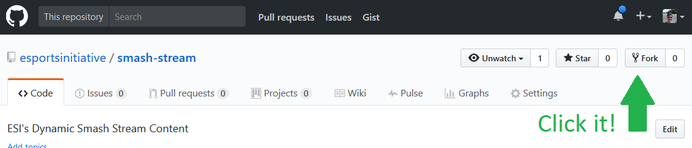

# Smash Stream

ESI's Dynamic Smash Stream Content. Based on the [Tip of the Hats 4 - Overlay](https://github.com/TipoftheHats/toth4-overlay) but modified for a smash tournament running (see [What does it do?](#what-does-it-do))

<!-- TOC depthFrom:2 -->

- [What does it do?](#what-does-it-do)
    - [Includes](#includes)
- [Setup](#setup)
    - [Local](#local)
    - [Docker](#docker)
- [Credits](#credits)

<!-- /TOC -->

## What does it do?

It provides a dashboard text update system that populates content positioned via HTML over the `png` overlay designs. We used [ai2html](http://ai2html.org/) to quickly turn our `.ai` overlay files into dynamic overlay material which is present thoughout the system. Slight tweets to text positioning were required after the ai2html conversion but this process minimized the design to production window.


This system was used by the [eSports Initiative](http://esi.gg) throughout their production of [Shuffle: Battle of the Midwest](https://smash.gg/tournament/shuffle-battle-of-the-midwest).

### Includes

- [x] Content editing dashboard
- [x] Game (Melee), players and casters "Hub" screen
- [x] Melee game overlay
- [x] Smash 4 game overlay
- [x] BRB screen with Smash 4 looping video
- [x] Shuffle and ESI branding assets :tada: ;)

## Setup
---

There are a few ways to install and run this overlay system:

Type | Instructions | Pros | Cons
--- | --- | --- | ---
Local | Do a [local install](#local) | - Easier install <br> - Less computer resources <br> - Less Windows requirements | - Less isolated
Docker | Do a [docker install](#docker) | - Install isolation | - More knowledge required <br> - Unix, Mac, or **Windows 10 Pro** required

Additionally, if you want to maintain a copy of the resources beyond your local install create a [Github](https://github.com/) account and fork the repositiory to your user. <div style="height:150px;"></div>


### Local

Install Nodecg and Nodecg CLI

1. Install [NodeCG](http://github.com/nodecg/nodecg) and the [Nodecg CLI](https://www.npmjs.com/package/nodecg-cli) which includes installing:
	- [x] Node & npm
	- [x] Nodecg
	- [x] Nodecg CLI -- Simplifies install steps (this can be used to install nodecg actually)
2. Navigate to your nodecg directory in a terminal (PowerShell, CMD, Git-Bash, or other) using:
	- `cd` (change directory) -- `cd ..` to go up a directory `cd <folder>` to go down
	- `pwd` (print working directory) -- see where you are
	- `ls` (list directories) -- see where you can go
	- **Hint**: On windows copy the path from File Explorer and `cd` directly to that ex: `cd C:\user\...`
3. Install the repository by running `nodecg install esportsinitiative/smash-stream` in a terminal
4. Launch the overlay with `nodecg start`
5. Navigate to: `localhost:9090/`
6. Use the overlay and profit!

### Docker

**NOTE**: For Docker steps if installing on Windows only **Windows 10 Pro** is supported (Docker/Microsoft requirement).

All of development and ESI's stream used this installation:

1. Install [Docker](https://www.docker.com/). If on Windows or Mac the **Docker Community Edition** is the version you'll want.
	- All terminal steps on Windows need to be within an **Administrator** PowerShell
2. Install [Git](https://git-scm.com/)
3. Then clone the repositiony: `git clone https://github.com/esportsinitiative/smash-stream.git`
4. Navigate to the `.../smash-stream/` directory. (Same process as Local Install instruction #2)
5. Build and run the `Dockerfile`:

```bash
docker build -t smash-stream .
# Replace `pwd` with $pwd` on Windows
docker run -it --rm -v `pwd`:/usr/src/app/nodecg/bundles/smash-stream/ -p 9090:9090 smash-stream bash
nodecg start
```

6. Navigate to: `localhost:9090/`
7. Use the overlay and profit!

## Credits

The overlays are based on the work of the [NodeCG Team](http://nodecg.com/) and the [Tip of the Hats 4 - Overlays](https://github.com/TipoftheHats/toth4-overlay). The Smash addaptation was done by:

- [David Soller](https://github.com/3ygun) - Developer
- [Elliot Schoolcraft]() - Designer
- Andrew Carringer - Editor
